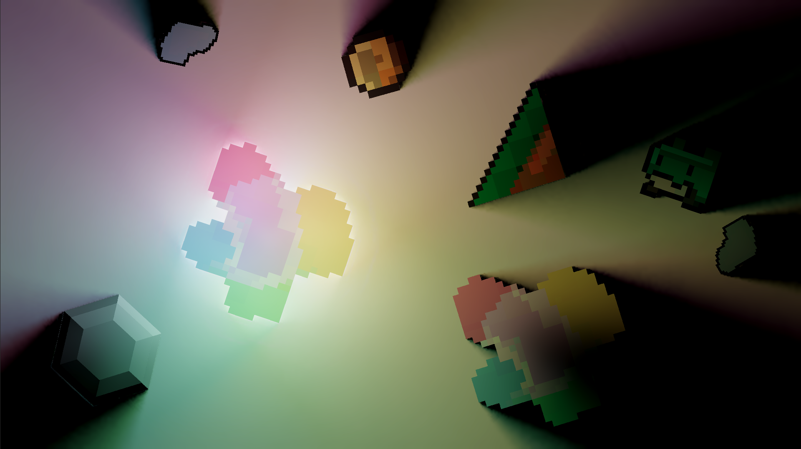

# Radiance Cascades World BVH

A real-time 2D Global Illumination system for Unity, combining the **Radiance Cascades** algorithm with **BVH (Bounding Volume Hierarchy)** acceleration for efficient ray-scene intersection in 2D sprite-based worlds.

## Overview

This system computes multi-bounce indirect lighting for 2D sprites at interactive frame rates. It leverages GPU compute shaders for the radiance cascade pipeline and a Burst-compiled Linear BVH (LBVH) for spatial acceleration, integrated into Unity's Universal Render Pipeline (URP) as a custom `ScriptableRendererFeature`.

## Architecture

```
Scene Management (RCWBObject, PolygonManager)
        |
Geometry Processing (Sprite Physics Shape -> Edge Extraction)
        |
BVH Construction (LBVH via Karras 2012, Burst-accelerated)
        |
GPU Compute Pipeline (RadianceCascadesWB.compute)
        |
Final Rendering (RCWB_Object.shader + Normal Mapping)
```

## Core Algorithms

### Radiance Cascades

A progressive multi-level ray marching scheme for GI. Each cascade level covers an exponentially increasing distance range, casting rays in 4 cardinal directions per grid cell. Coarser cascades are merged into finer ones to propagate indirect light efficiently, achieving O(log distance) complexity.

Key formulas:
- **Ray distance**: Exponential expansion per cascade level
- **Transmittance**: Beer's law attenuation `exp(-distance * density)`
- **Radiance blending**: Accumulated color weighted by transmittance and emission

### Linear BVH (LBVH)

Constructed each frame from sprite polygon edges using the Karras 2012 algorithm:

1. Extract edges from sprite physics shapes
2. Compute Morton codes (Z-order curve) for spatial hashing
3. Sort primitives by Morton code
4. Build binary tree topology in parallel (each internal node independent)
5. Bottom-up AABB refit with atomic counters
6. BFS reorder for GPU cache-friendly layout
7. Pack into compact GPU node format

### BVH Traversal (GPU)

Stack-based iterative traversal on the GPU with:
- Ray-AABB slab intersection for internal nodes
- Ray-line segment intersection for leaf edges
- Multi-hit collection (up to 4 intersections, sorted by distance)
- Interval extraction for solid region detection

## Key Features

- **Real-time 2D GI** with multi-bounce light transport
- **BVH-accelerated ray queries** rebuilt every frame via Burst Job System
- **Density-based transmittance** for physically plausible light absorption
- **Light direction extraction** from cascade results for normal-aware shading
- **Sprite interior/exterior handling** with separate invasion lighting
- **Dual Kawase blur** for smooth light diffusion
- **Atlas UV transformation** for correct sprite atlas sampling
- **Auto-registration** of scene objects via `RCWBObject` component

## Project Structure

```
RadianceCascadesWorldBVH/
├── Scripts/
│   ├── RCWBObject.cs                           # Per-sprite GI component
│   ├── PolygonManager.cs                        # Central scene & buffer manager
│   ├── PolygonBVHConstructor.cs                 # Reference CPU BVH builder
│   └── PolygonBVHConstructorAccelerated.cs      # Burst-optimized parallel BVH builder
├── Shaders/
│   ├── RadianceCascadesWB.compute               # Main GI compute shader
│   ├── RCW_BVH_Inc.hlsl                         # GPU BVH traversal library
│   └── RCWB_Object.shader                       # Final sprite shading (URP)
├── RenderFeatures/
│   └── RadianceCascadesWBFeature.cs             # URP ScriptableRendererFeature
└── Editor/
    └── SpritePhysicsShapeGenerator.cs           # Editor utility
```

## Component Reference

### RCWBObject

Attach to any sprite to include it in the GI system. Properties:

| Property | Description |
|---|---|
| `BasicColor` | Base albedo color |
| `Density` | Light absorption coefficient |
| `Emission` | HDR emission color for light sources |
| `giCoefficient` | GI intensity multiplier (0-10) |

### PolygonManager

Singleton that manages all registered objects, extracts polygon edges, builds the BVH each frame, and uploads data to GPU buffers.

### RadianceCascadesWBFeature

URP render feature that orchestrates the full pipeline:
1. Dispatch compute shader for each cascade level (coarse to fine)
2. Extract dominant light direction
3. Compute interior invasion lighting
4. Apply Dual Kawase blur
5. Bind results as global textures for final shading

## Data Structures

**LBVHNodeGpu** (compact GPU node):
- `float2 PosA, PosB` -- AABB bounds (internal) or edge endpoints (leaf)
- `int IndexData` -- Left child index (>=0) or `~materialIndex` (<0 for leaf)
- `int RightChild`

**MaterialData** (per-object):
- `float4 BasicColor, Emission`
- `float4 uvMatrix` + `float2 uvTranslation` -- World-to-atlas UV transform
- `float Density`

## Requirements

- Unity with Universal Render Pipeline (URP)
- Burst package (for accelerated BVH construction)

## Acknowledgments

This project utilizes the following assets from the Unity Asset Store: 

*   **[ Simple 2D Platformer Assets Pack
 ](https://assetstore.unity.com/packages/2d/characters/simple-2d-platformer-assets-pack-188518)** 
    *    Author：Goldmetal
    *   Used for testing the environmental spirits and physical collision bodies in the scenario